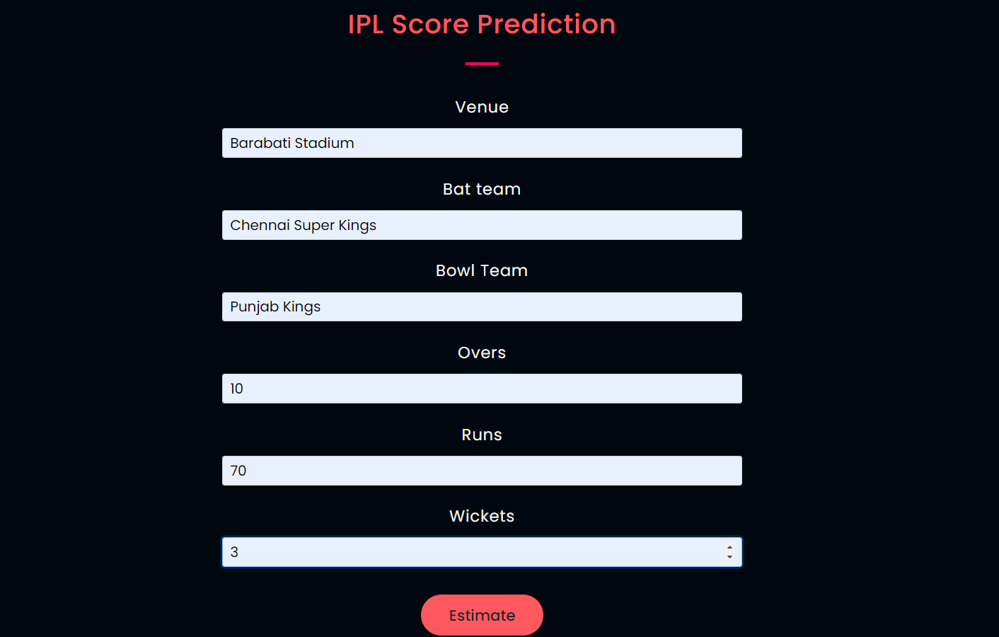

# IPL Score Predictor

## Introduction

This project aims to predict IPL Scores depending on the input entered. *Random Forest Regressor* is the algorithm used to predict the scores using a 5 fold cross validation.

## Dependencies

* [Python 3](https://www.python.org/)
*  [OpenCV](https://opencv.org/)
* [Pandas](https://pandas.pydata.org/)
* [Numpy](https://numpy.org/)
* [SKlearn](https://scikit-learn.org/)

If you dont have Python installed in your PC ,it can be installed from here [python](https://www.python.org/downloads/).

Hit the command in CMD/Terminal if you don't have it already installed:

    pip install opencv-python

   (OR)
   
 Install OpenCV via anaconda
  
    conda install -c menpo opencv
    
## How to run the code
Clone the Repository and extract the files

1. Go to the folder where app.py file is present
2. Type cmd in the file path 
3. Run the code with command `python app.py`
4. Enter the Venue,Batting team, Bowling Team, Overs, Balls and Runs Scored and click on Predict to see the results.

## Algorithm

* Fisrt, We take the dataset and create folds to prevent overfitting and for reproducibility.

* Do some EDA and analyse the data for missing value imputation, remove outliers and the irrelevant columns.

* Apply One Hot encoding/Label Encoding depending on the unique factors of each columns.

* Start training your data on a couple of algorithms without tuning to decide the best algorithm.

* Once you choose the best algorithm , hypertune it for better performance.

* Now train the model using the entire dataset and generate the results.

## Example Output

